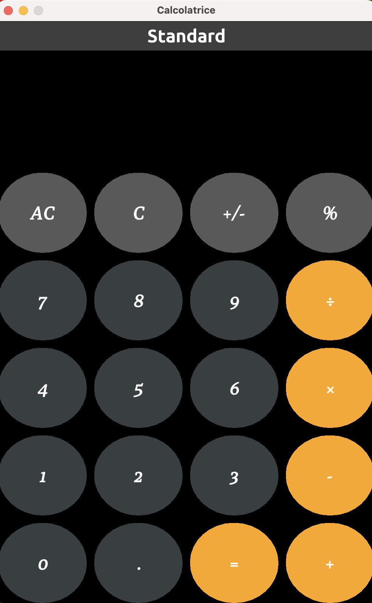
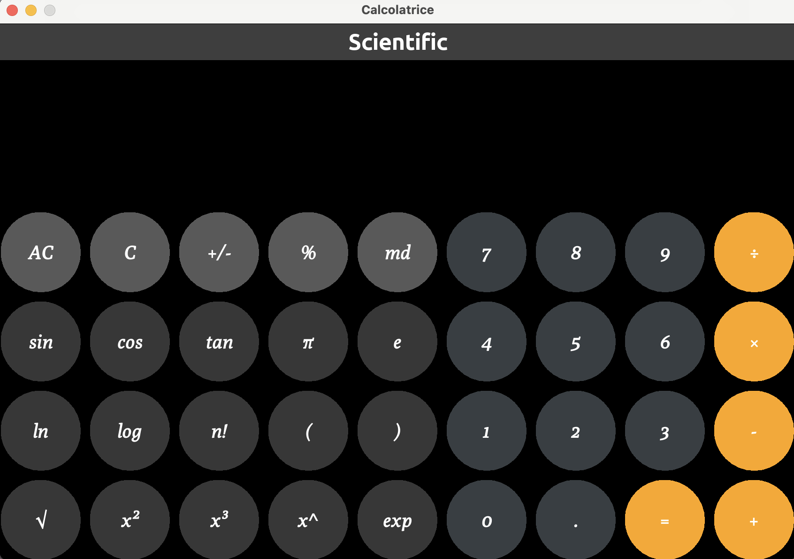
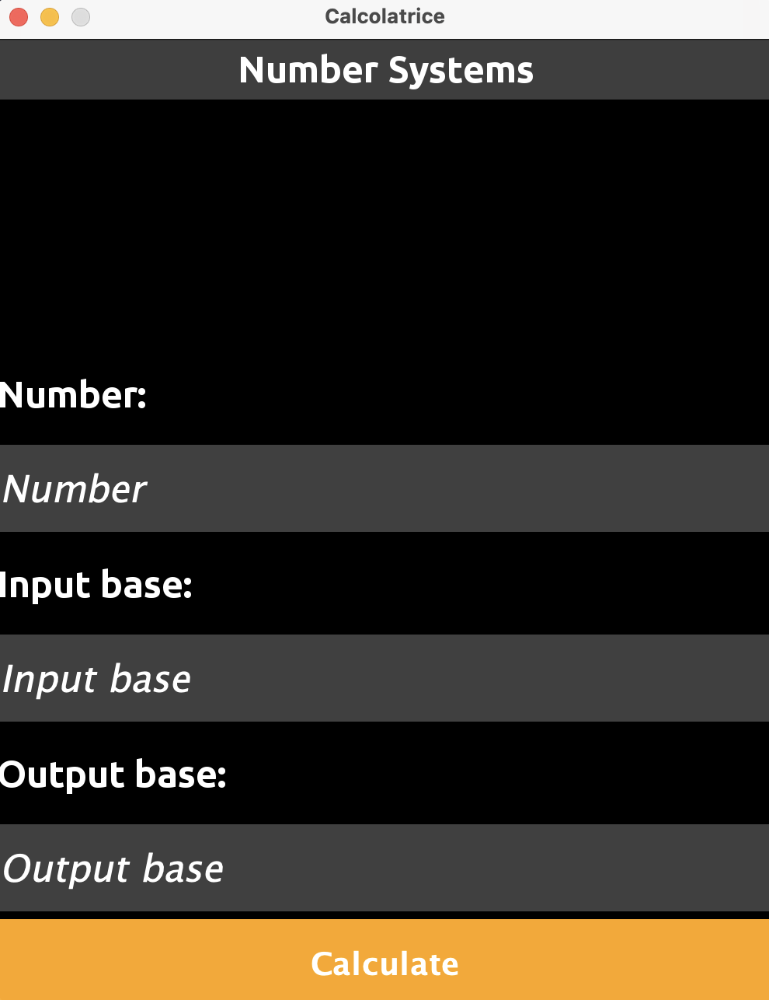

# Java Calculator Application

## 📋 Project Description
This repository contains a **Java-based Calculator Application** with a Graphical User Interface (GUI) built using **AWT** and **Swing**. The project is designed to perform basic arithmetic operations and includes a custom GUI framework.

The project structure includes modular components, custom fonts, and icons, along with a parser for handling mathematical expressions.

---

## 📦 Download
- [👉 Download the Calc.jar file](https://github.com/Fraalloo/Calc/releases/latest)

## 📁 Project Structure
```
.
├── Application.java          # Main entry point of the application
├── Calc.jar                  # Compiled JAR file to run the application
├── License.txt               # License file
├── Makefile                  # Build automation script
├── assets                    # Resources used in the application
│   ├── fonts                 # Custom fonts
│   └── imgs                  # Application icons
├── calc                      # Calculator-specific components
│   └── components            # GUI components for the calculator
└── giava                     # Custom Java framework for data structures, GUI, and math utilities
```

### Key Directories:
- **`assets/fonts`**: Contains custom fonts such as *Poly* and *Ubuntu* with corresponding license files.
- **`assets/imgs`**: Includes application icons like `icon.png`.
- **`calc/components`**: Contains GUI components like `Display.java`, `InputField.java`, and `Pulsantiera.java`.
- **`giava`**: Custom Java framework divided into three main packages:
  - **`datastr`**: Custom data structures including `LinkedList`, `Queue`, and `Stack`.
  - **`gui`**: Custom GUI components such as `GButton`, `GCircularButton`, `GFrame`, etc.
  - **`math`**: Math utilities including expression parsers and exception handling.

---

## 🚀 How to Run the Application

### **Prerequisites**
Make sure you have:
- **Java Development Kit (JDK)** version 8 or higher
- A terminal or command-line tool

### **Running the JAR File**
To execute the calculator application directly from the JAR file:
```bash
make jarun # or java -jar Calc.jar
```

### **Building the Project with Makefile**
If you want to compile and create JAR archive from the project manually using the Makefile:
```bash
make jar
```

### **Other useful Makefile commands**
```bash
make comp # Compiles the .java files in bytecode (.class)
make run # Runs bytecode files
make clean # Deletes bytecode files
make crc # Combination of 'comp' 'run' and 'clean'
make doc # Creates code documentation using Javadoc in 'doc' directory
make deldoc # Deletes 'doc' directory
```

---

## 🎨 Screenshots
<div align="center"></div>
<div align="center"></div>
<div align="center"></div>
<div align="center"></div>

---

## 📚 Code Overview
### **Main Components**
#### `Application.java`
The main entry point that initializes and runs the calculator application.

#### **Calculator Components (`calc`)**
- **`Calcolatrice.java`**: Core calculator logic.
- **`components/Display.java`**: Handles the display of numbers and results.
- **`components/InputField.java`**: Manages user input fields.
- **`components/Pulsantiera.java`**: Represents the button panel.

#### **Custom Framework (`giava`)**
##### **Data Structures (`datastr`)**
- `LinkedList.java`
- `Queue.java`
- `Stack.java`

##### **GUI Components (`gui`)**
- `GButton.java`: Custom button component.
- `GCircularButton.java`: Circular button component.
- `GFrame.java`: Custom window frame component.
- `GRectangularButton.java`: Rectangular button component.
- `GTextField.java`: Custom text field component.

##### **Math Utilities (`math`)**
- `GMath.java`: Math utility functions.
- **Exceptions (`exceptions`)**: Custom exception handling classes for math operations.
  - `MathBaseException.java`
  - `MathException.java`
  - `MathNumberBaseException.java`
  - `MathSyntaxError.java`

- **Parser (`parser`)**: Classes for parsing and building mathematical expression trees.
  - `AbstractSyntaxTree.java`
  - `BinaryOperatorNode.java`
  - `FunctionNode.java`
  - `Node.java`
  - `NumberNode.java`
  - `Parser.java`

---

## 🧰 Technologies Used
- **Java**
- **AWT**
- **Swing**
- **Makefile**

---

## 📜 License
This project is licensed under the **MIT License**. See the `License.txt` file for more details.

---

## 📧 Contact
- **Author**: [Gallo Francesco](https://github.com/Fraalloo)
- **Email**: gallfrancgall@gmail.com